# BramkiUsers

Internal web application for managing employees, access cards, permissions, and related administrative workflows.

The system integrates multiple data sources and services to provide a unified interface for:

- Employee data management  
- Card issuing and replacement  
- Lost card reporting  
- Group and permission management  
- Email notifications and workflow automation  
- Integration with external access-control and HR systems  

The application is designed to streamline daily administrative tasks and reduce manual coordination between departments.

---

## Overview

BramkiUsers is built as a **Blazor Server application** with:

- Windows Authentication
- Role/Group-based authorization
- Entity Framework Core
- SQL Server databases
- WCF service integration
- Email templating and delivery
- Audit logging

The interface is optimized for fast navigation and operational workflows.

---

## Main Features

### Employee Management
- Browse and search employees
- Filter by department, name, or employee number
- View employee details and permissions
- Edit personal and departmental data

### Access Card Management
- Issue new cards
- Replace cards
- Report lost cards
- Track card numbers and permissions

### Permissions and Groups
- Assign groups
- Modify access permissions
- Synchronize changes with external systems

### Offboarding Workflow
- Deactivate employees
- Remove permissions
- Notify related departments
- Trigger automated cleanup tasks

### Email Automation
The system sends structured notification emails for:
- Card issuing
- Card loss
- Department changes
- Access permission changes
- Offboarding workflows

Templates are HTML-based and support dynamic placeholders.

### Audit Logging
Operations such as:
- Editing employees
- Issuing cards
- Removing access
- Updating groups  

are logged with structured audit records.

---

## Technology Stack

- .NET
- Blazor Server
- Entity Framework Core
- SQL Server
- Windows Authentication (Negotiate)
- WCF services
- SMTP mail delivery
- Razor Components
- Bootstrap-based UI

---

## Architecture

The application is organized into logical layers:

**UI Layer**
- Razor Pages / Blazor Components
- Toast notifications
- Forms and workflow screens

**Application Layer**
- Employee state management
- Department lookup services
- Mail templating system
- Audit infrastructure

**Data Layer**
- Raportowanie database context
- HR database context
- Entity models and mappings

**Integration Layer**
- External access-control services
- Credential management
- Group synchronization

---

## Project Structure

    BramkiUsers/
     ├── Components/
     │    ├── App.razor
     │    ├── Routes.razor
     │    ├── SecureNavLink.razor
     │    ├── EmployeeSummaryReadonly.razor
     │    ├── GatesDataPrompt.razor
     │    └── Pages/
     │         ├── MainMenu.razor
     │         ├── MainMenu.razor.css
     │         ├── Hiring.razor
     │         ├── EmployeesList.razor
     │         ├── EmployeesList.razor.css
     │         ├── Emails.razor
     │         ├── Emails.razor.css
     │         └── Employees/
     │              ├── EmployeeMenu.razor
     │              ├── EmployeeMenu.razor.css
     │              ├── Edit.razor
     │              ├── Fire.razor
     │              ├── Groups.razor
     │              └── Cards/
     │                   ├── CardsMenu.razor
     │                   ├── CardsMenu.razor.css
     │                   ├── Issue.razor
     │                   ├── Issue.razor.css
     │                   ├── Lost.razor
     │                   └── Replacement.razor
     │
     ├── Data/
     │    └── Contexts.cs
     │
     ├── Infrastructure/
     │    ├── Audit.cs
     │    ├── CurrentUserService.cs
     │    ├── DepartmentLookup.cs
     │    ├── DevGroupSidClaims.cs
     │    ├── Email.cs
     │    ├── EmailTemplates.cs
     │    ├── EmployeeState.cs
     │    └── SimpleLogEntryTextBuilder.cs
     │
     ├── Services/
     │    └── ToastService.cs
     │
     ├── Wcf/
     │    ├── VisoClientFactory.cs
     │    ├── VisoFacadeShared.cs
     │    ├── VisoOptions.cs
     │    └── VisoSessionManager.cs
     │
     ├── Connected Services/
     │    ├── BramkiUsers.ConfigurationQuery/
     │    │    ├── ConnectedService.json
     │    │    └── Reference.cs
     │    ├── BramkiUsers.SystemSynchronization/
     │    │    ├── ConnectedService.json
     │    │    └── Reference.cs
     │    ├── BramkiUsers.SessionManagement/
     │    │    ├── ConnectedService.json
     │    │    └── Reference.cs
     │    ├── BramkiUsers.Communication/
     │    │    ├── ConnectedService.json
     │    │    └── Reference.cs
     │    └── BramkiUsers.Integration/
     │         ├── ConnectedService.json
     │         └── Reference.cs
     │
     ├── Shared/
     │    ├── MainLayout.razor
     │    ├── MainLayout.razor.css
     │    ├── Toast.razor
     │    ├── Toast.razor.css
     │    └── ToastHost.razor
     │
     ├── wwwroot/
     │    ├── app.css
     │    ├── favicon.png
     │    ├── bootstrap/
     │    ├── icons/
     │    │    ├── Asterisk.svg
     │    │    ├── Back.svg
     │    │    ├── BramkiPracownicy.png
     │    │    ├── Close.svg
     │    │    ├── Counter.svg
     │    │    ├── Counter-disabled.svg
     │    │    ├── Down.svg
     │    │    ├── E-Mail.svg
     │    │    ├── E-Mail-disabled.svg
     │    │    ├── EdycjaDanych.svg
     │    │    ├── EdycjaDanych-disabled.svg
     │    │    ├── Grupy.svg
     │    │    ├── Grupy-disabled.svg
     │    │    ├── ID.svg
     │    │    ├── ID-disabled.svg
     │    │    ├── Karty.svg
     │    │    ├── Karty-disabled.svg
     │    │    ├── Pracownicy.svg
     │    │    ├── Pracownicy-disabled.svg
     │    │    ├── Right.svg
     │    │    ├── Save.svg
     │    │    ├── Save-disabled.svg
     │    │    ├── Zatrudnianie.svg
     │    │    ├── Zatrudnianie-disabled.svg
     │    │    ├── ZgubioneKarty.svg
     │    │    ├── ZgubioneKarty-disabled.svg
     │    │    ├── Zwalnianie.svg
     │    │    └── Zwalnianie-disabled.svg
     │    ├── templates/
     │    │    ├── BazaJakości.html
     │    │    ├── BazaJakości-changed.html
     │    │    ├── BazaJakości-fire.html
     │    │    ├── HR.html
     │    │    ├── Karta.html
     │    │    ├── Karta-changed.html
     │    │    ├── Karta-lost.html
     │    │    ├── Obiady.html
     │    │    ├── Obiady-fire.html
     │    │    ├── Obiady2.html
     │    │    ├── Obiady2-fire.html
     │    │    ├── Szafki-changed.html
     │    │    ├── Szafki-fire.html
     │    │    ├── SzafyŚOI.html
     │    │    ├── SzafyŚOI-fire.html
     │    │    ├── Wózki.html
     │    │    └── Wózki-fire.html
     │    └── footer/
     │         ├── footer-logo.png
     │         └── mail-footer.html
     │
     ├── appsettings.json
     ├── appsettings.Development.json
     ├── MailTemplates.json
     ├── Program.cs
     └── _Imports.razor

---

## Authentication and Authorization

The application uses:

- Windows Authentication
- Group/SID-based policies
- Page-level authorization

Policies control access to:
- Editing employees
- Issuing cards
- Replacement cards
- Lost cards
- Groups management
- Emails configuration

---

## Email Templates

Email templates are stored as HTML files and support:

- Placeholder substitution
- Conditional sections
- Standardized formatting
- Reusable footer

Templates are used for operational workflows and notifications.

---

## Logging and Auditing

Audit logging captures:

- User performing the action
- Operation name
- Input parameters
- Errors and warnings
- Completion state

This ensures traceability of administrative actions.

---

## Running the Application

Requirements:

- Windows Server or Windows workstation
- .NET runtime
- SQL Server access
- Network access to required services

Steps:

1. Configure connection strings and services
2. Build the application
3. Run using IIS or Kestrel
4. Authenticate using Windows credentials

---

## Possible Future Improvements

- Role management UI
- Advanced reporting
- Background job processing
- Improved audit dashboards
- REST API layer
- Containerized deployment

---

## Screenshots

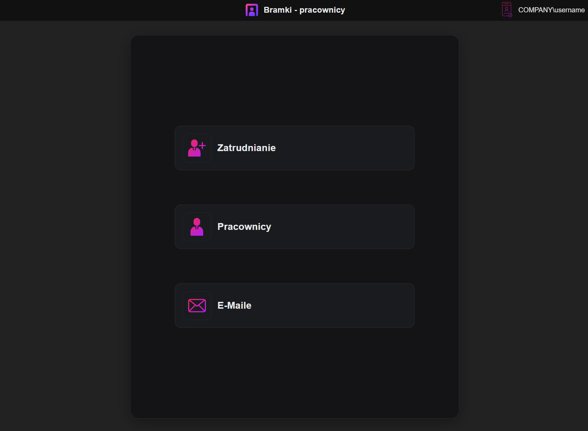
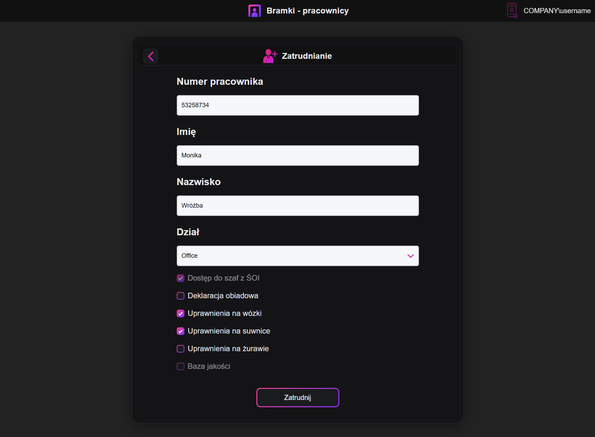
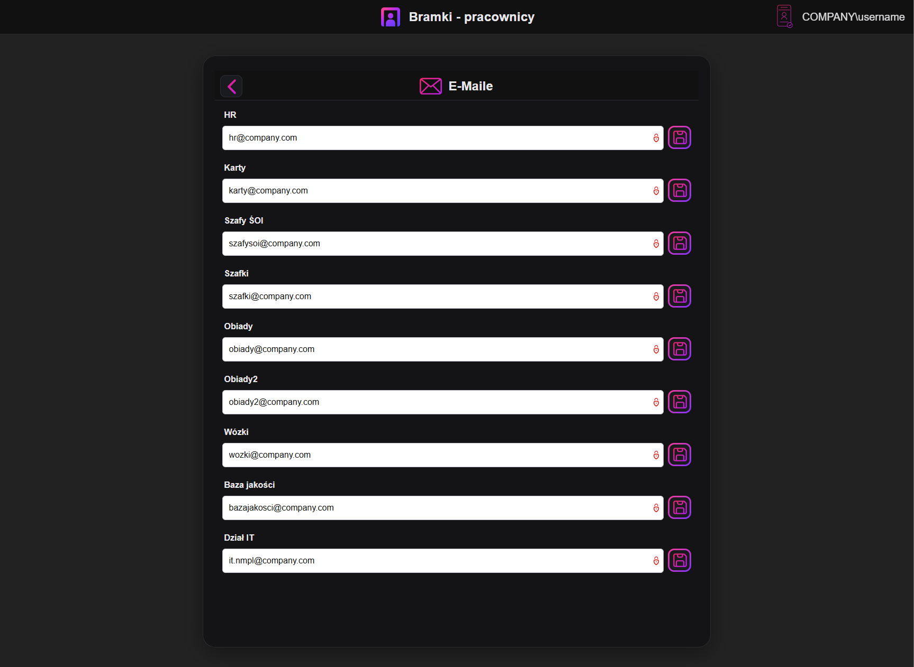
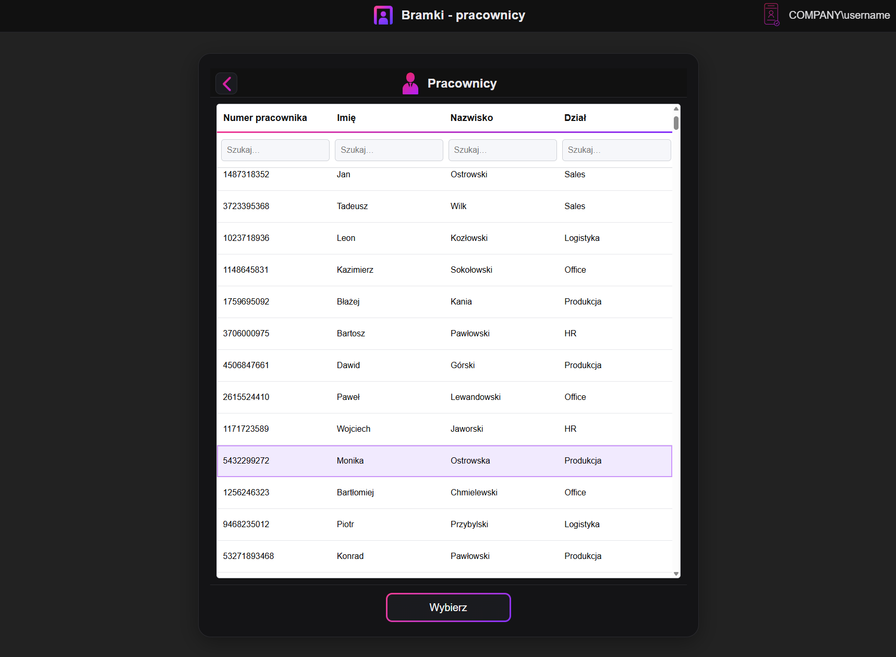
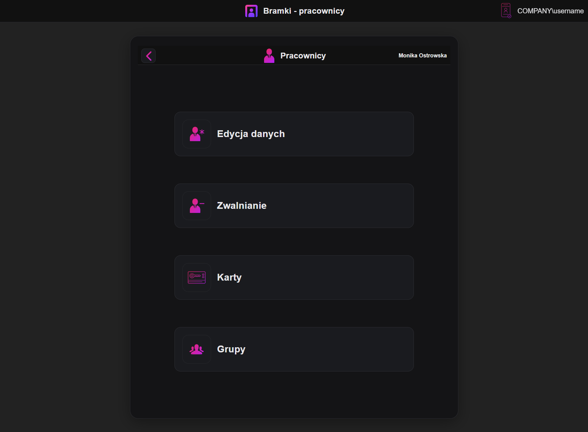
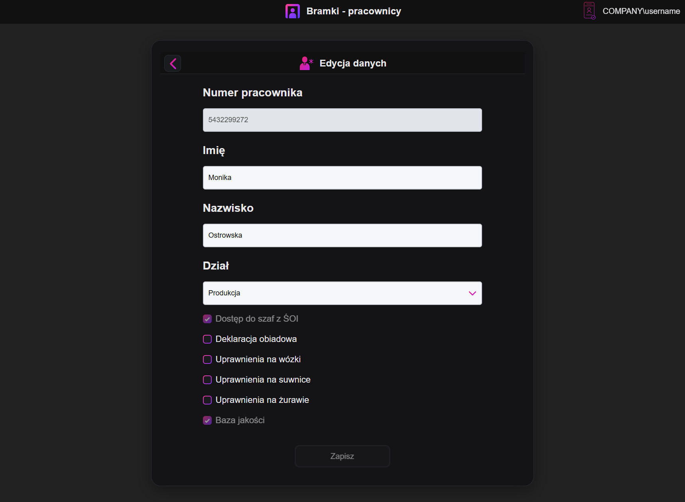
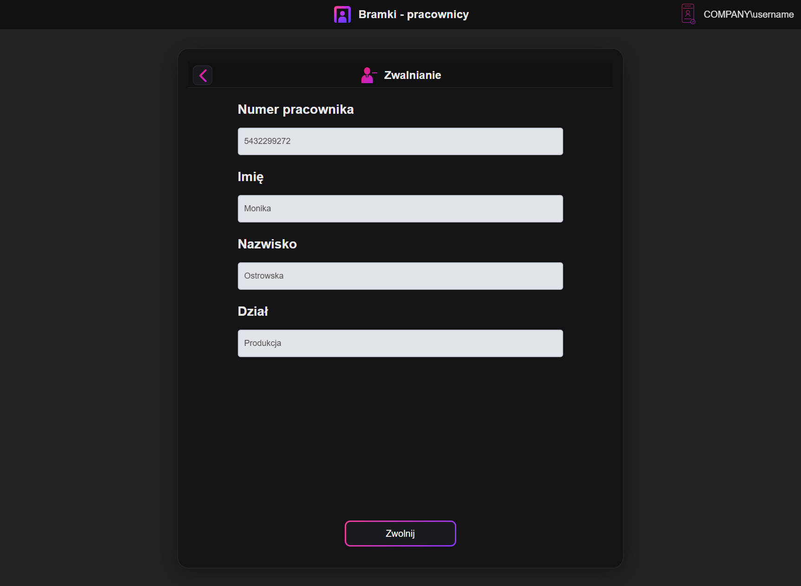
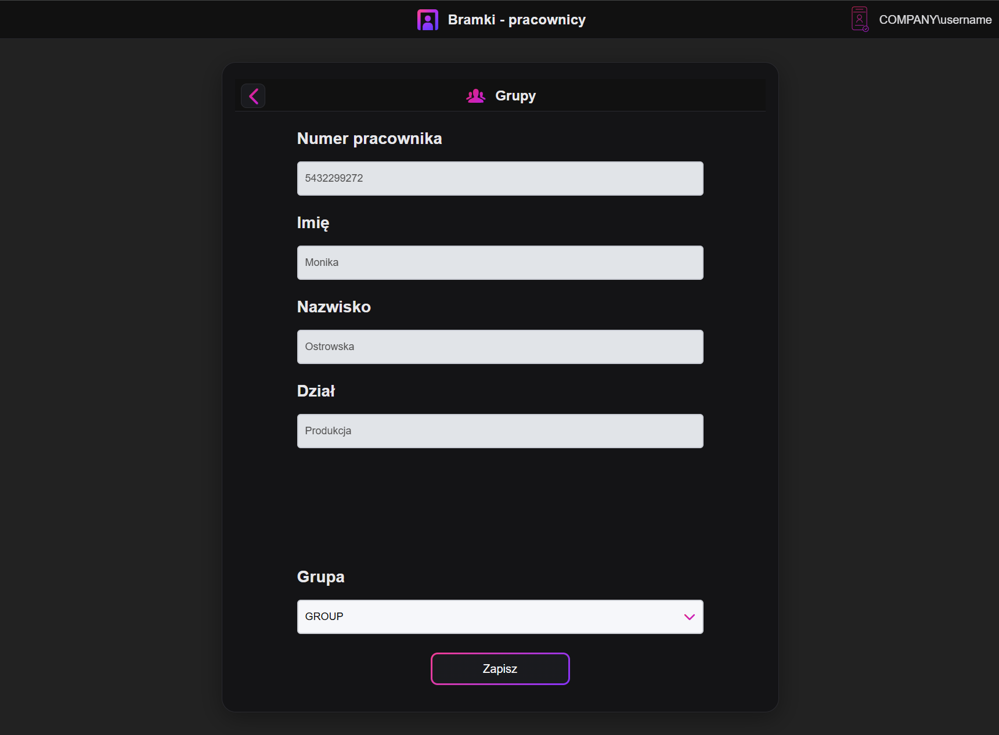
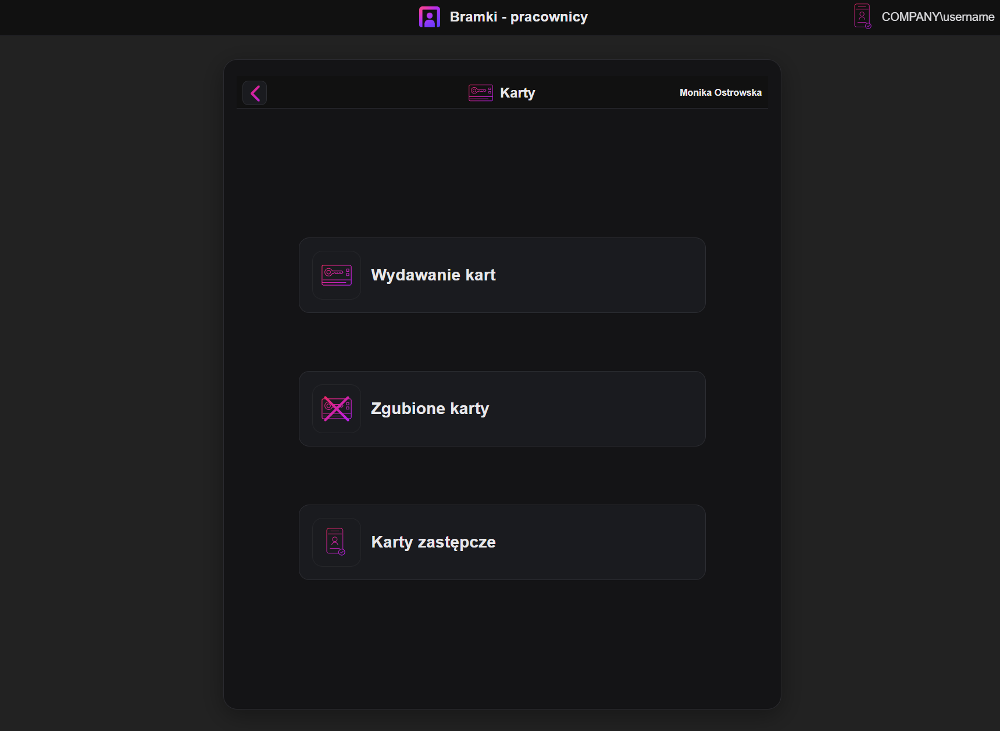
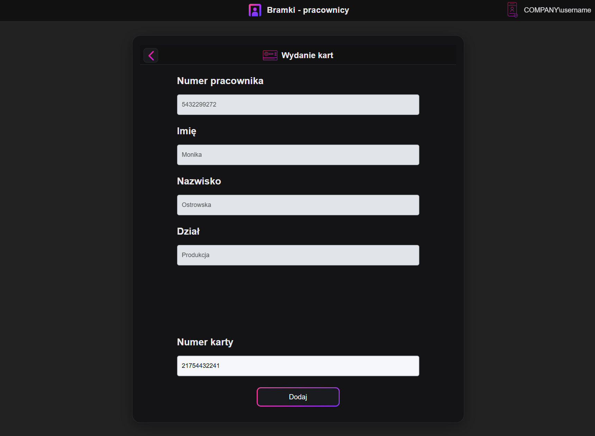
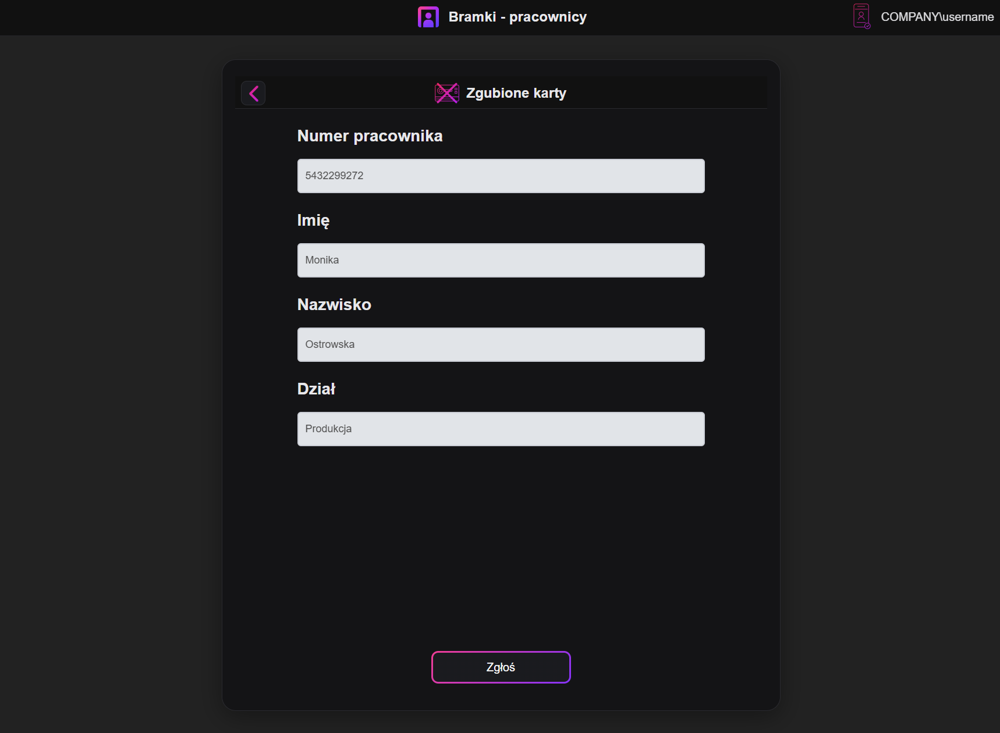
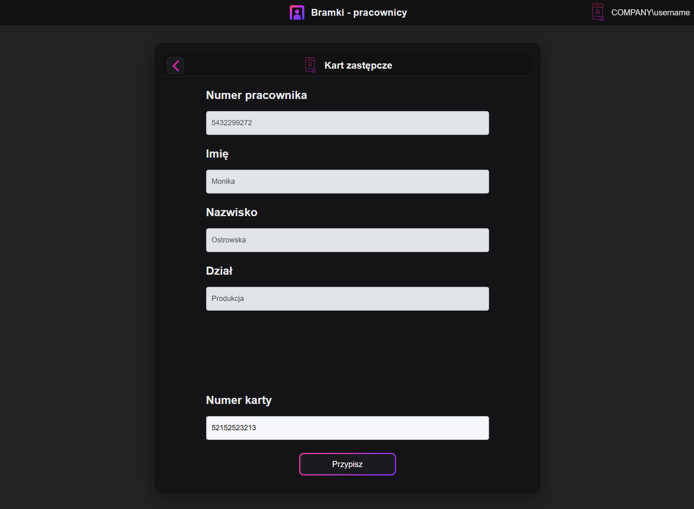
